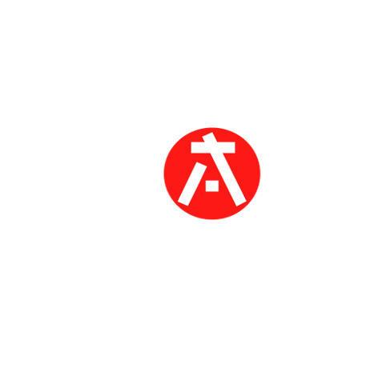

# Hi There 👋

We are **CCAM** - ***Centro Cultural Anime y Manga***, a cultural center from
[UNI](https://portal.uni.edu.pe/) and this is the repository of our [web page](https://ccanimanga.vercel.app).

We are from Lima-Perú and carry out many artistic and cultural activities.

## Workshops 🎨

- Manga.
- Origami.
- Shogi.
- Hama-Beads.
- etc.

## 🎨 Activities

- Screenings.
- Presentations. 
- Events.
- etc.

